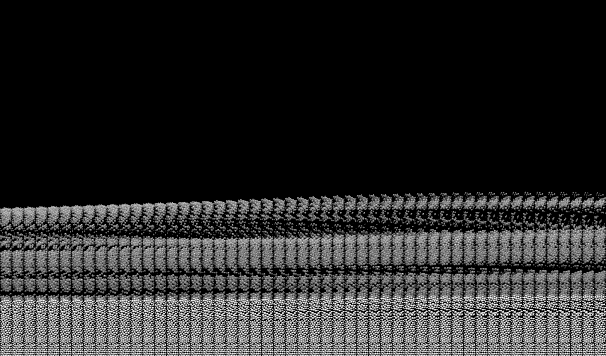

# joinPhotos

Program to make series of images of fluidized beds to show evolution of the beds.

## Install

On CMakeLists.txt fix the [opencv](https://docs.opencv.org/4.x/d7/d9f/tutorial_linux_install.html) build path for your computer, for example **/home/user/opencv/build**.

```cmake
find_package( OpenCV REQUIRED PATHS /home/user/opencv/build NO_DEFAULT_PATH)
```

Run to configure the compiler.
```bash
cmake .
```

Run to compile the program. 
```bash
make
```

## Usage

Run the command as:
```bash
./joinImages -p "Path/to/images/" -i t0 -d dt -l tf -v height [-f framerate]
        [-a labels] [-y yScale] [-x xNumber] [-s textScale]
```

Where:
- "Path/to/images/" : is the path to the images saved with the pattern "image_*.tif"
- t0 (int) : first frame
- dt (int) : frames to skip between images
- tf (int) : end frame
- height (int) : height of the final joined image (crop extra blank space)
- framerate (int) : frame rate of the images (number of images per second - default 1000)
- labels (0 or 1) : bool to choose if axis labels are printed (default 1)
- yScale (int) : smallest division in y-axis (unit of diameters - default 5 H/D)
- xNumber (int) : number of time labels printed (default 5)
- textScale (float) : scale of the text (default 0.04)

Example:
```bash
./joinImages -p "/media/dados/Teste_00/" -i 1000 -d 50 -l 2000 -v 1500 -f 1000 -a 1 -y 5 -x 5 -s 0.05
```


## Result


